# </>💻✈️ FlightControl  

**FlightControl** es una aplicación de escritorio para la **gestión integral de una red de vuelos** en un aeropuerto internacional (simulación). El sistema permite administrar aeropuertos, vuelos y rutas óptimas mediante una estructura de datos propia: un **grafo dirigido y ponderado implementado desde cero** con listas de adyacencia.  

Este proyecto fue desarrollado en equipo con **Darwin Diaz** y **Xavier Guzmán** como parte de nuestra formación en **programación en Java**, aplicando conceptos sólidos de **estructuras de datos**, **algoritmos de grafos**, **Java Collection Framework**, **JavaFX** y persistencia de datos con objetos serializados.  

---

## 📖 Descripción  

FlightControl ofrece una experiencia completa tanto para la **gestión de aeropuertos** como para la **planificación de vuelos y rutas**.  

El sistema está diseñado para simular la operatividad real de un aeropuerto:  

- **Administradores**: pueden crear, modificar y eliminar aeropuertos y vuelos, así como generar estadísticas de conectividad y reportes en PDF.  
- **Usuarios**: pueden consultar rutas óptimas entre aeropuertos, visualizar el grafo de vuelos y explorar estadísticas gráficas.  

Se trata de una **plataforma académica robusta**, construida con buenas prácticas y pensada para poner en práctica los fundamentos de la programación orientada a objetos, algoritmos y diseño de software.  

---

### ⚙️ Características principales  

- 🛫 **Gestión de Aeropuertos**: Crear, leer, actualizar y eliminar aeropuertos de la red.  
- 🛬 **Gestión de Vuelos**: CRUD completo de vuelos entre aeropuertos.  
- 🧭 **Planificación de rutas óptimas**: Algoritmo de **Dijkstra** para encontrar la ruta más corta entre dos aeropuertos.  
- 📊 **Estadísticas visuales**: Gráficos de barras que muestran conectividad de vuelos de entrada y salida.  
- 📝 **Generación de reportes en PDF**: Exportación de estadísticas para la toma de decisiones.  
- 🖥️ **Interfaz moderna y clara**: Desarrollada en **JavaFX**, aplicando principios de Interacción Humano-Computador.  
- 🌐 **Visualización de la red**: Uso de **JGraphX** para mostrar gráficamente el grafo de vuelos.  

---

## 🧩 Patrones y buenas prácticas  

- ✨ **Código limpio y modular** con separación de responsabilidades (MVC).  
- 📂 **Persistencia de datos** con objetos serializados en el sistema de archivos del usuario.  
- 🔄 **Patrón Observador**: actualización automática de la interfaz al modificar el grafo.  
- 🔑 **Singleton** para el contexto del grafo, garantizando una única fuente de verdad.  
- ⚡ **Estructuras de datos eficientes** para optimizar la manipulación de la red de vuelos.  

---

## 🛠 Tecnologías Usadas  

- 🟢 **Java** – Lógica del sistema y estructuras de datos.  
- 🎨 **JavaFX** – Interfaz gráfica de usuario con patrón MVC.  
- 🗄️ **Java Collection Framework** – Manejo de listas, mapas y estructuras auxiliares.  
- 🔗 **JGraphX** – Visualización del grafo de vuelos.  
- 📄 **iText** – Generación de reportes PDF.  

---

## 📸 Imágenes del Proyecto  

Puedes ver más imágenes en la carpeta [`assets`](./assets).  

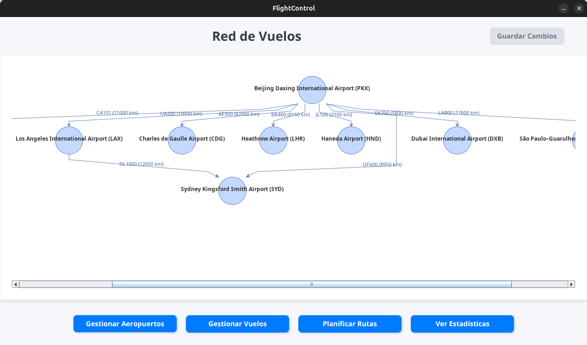  
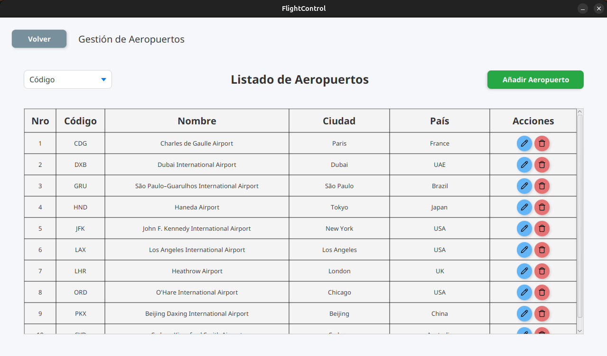  
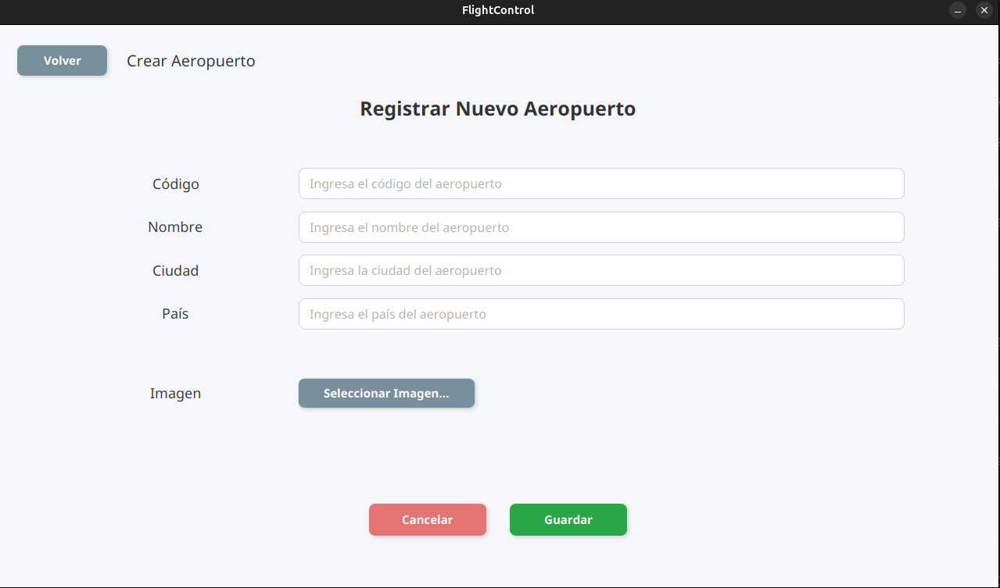  
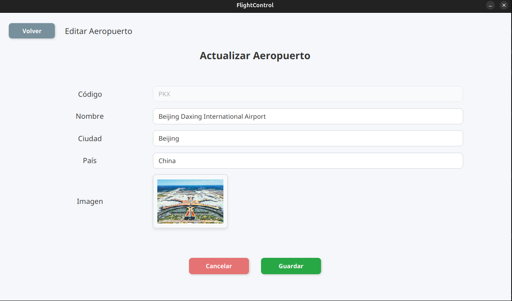  
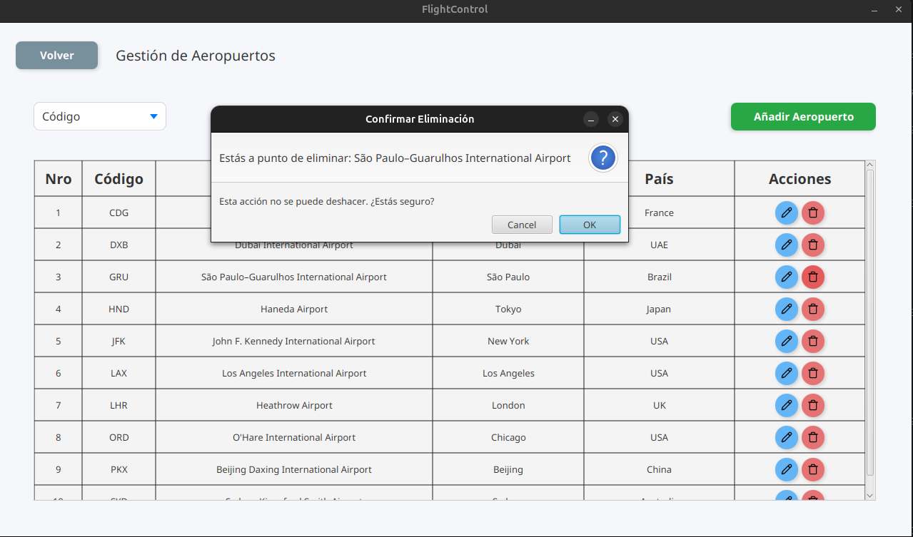  
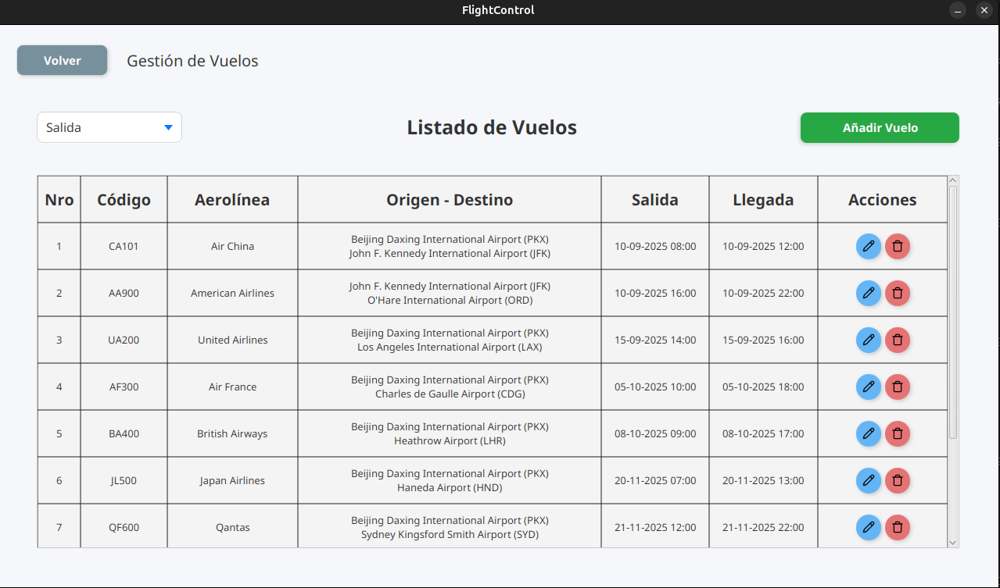  
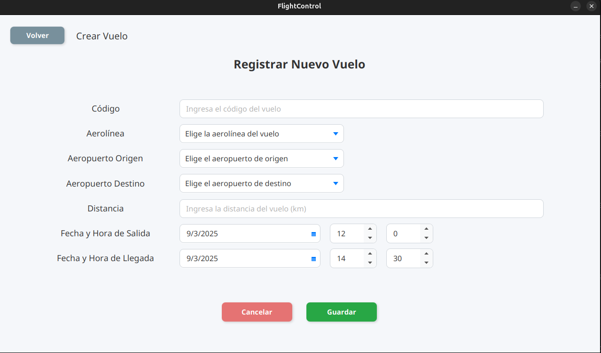  
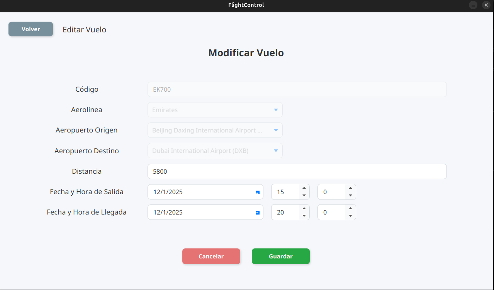  
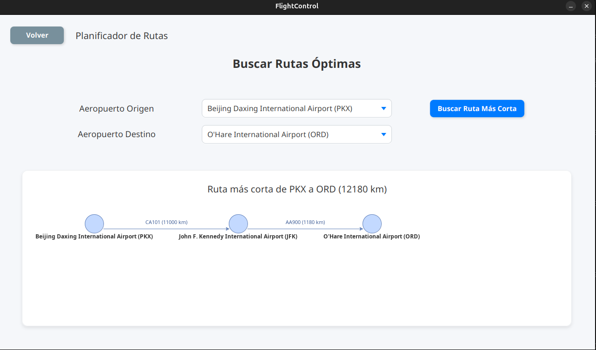  
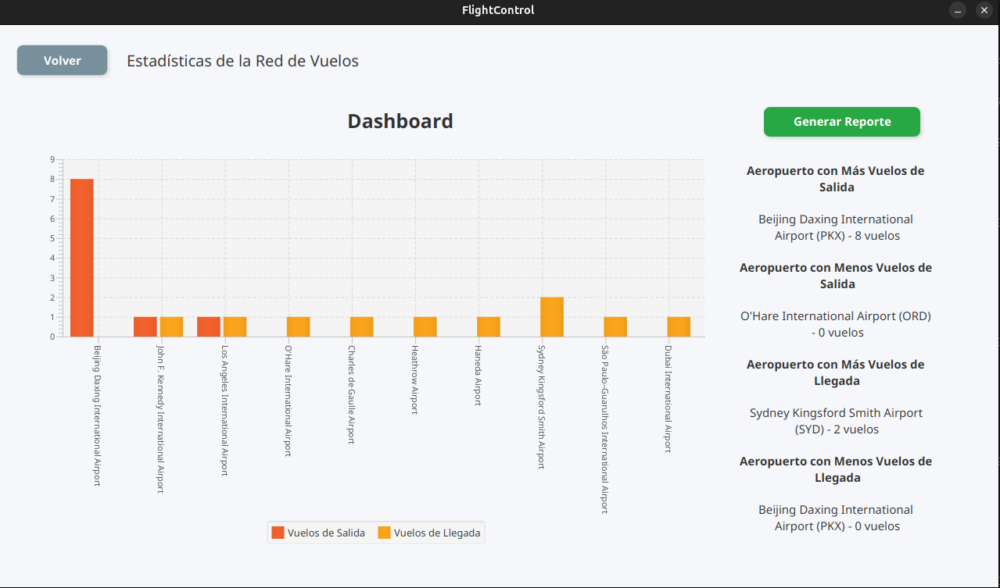  
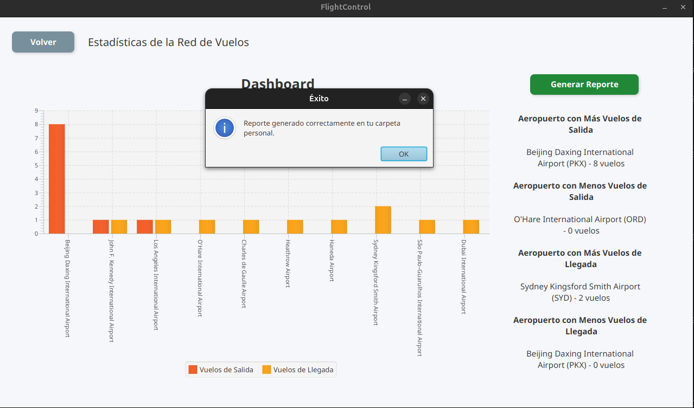  
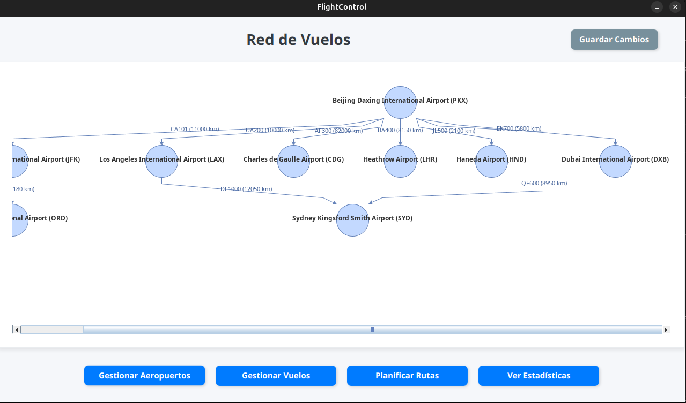  
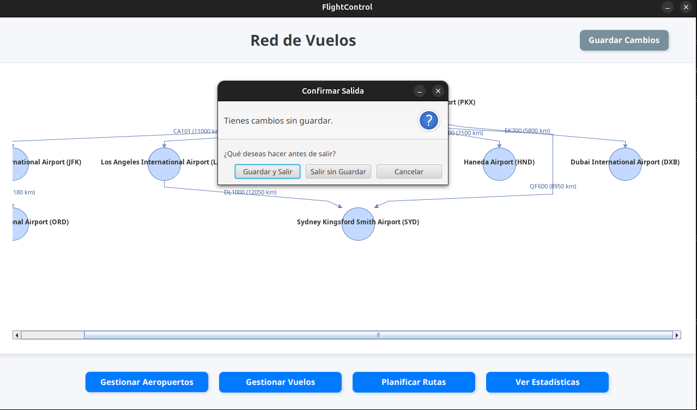  
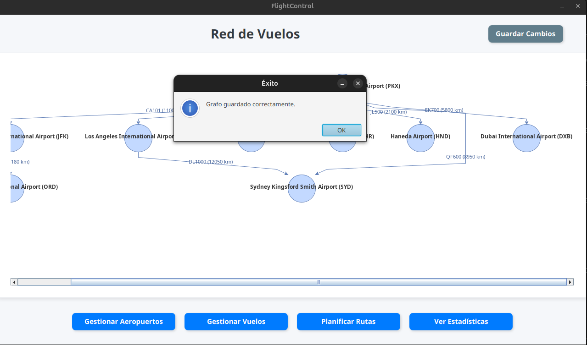  

---

## 👨‍💻 Autores  

Desarrollado por:  

- **[Gatumbac](https://github.com/Gatumbac)**  
- **[Darwin4050E](https://github.com/Darwin4050E)**  
- **[xavguz](https://github.com/xavguz)**  

📧 Contacto: gatumbac@espol.edu.ec  
📌 LinkedIn: [Gabriel Tumbaco](https://www.linkedin.com/in/gabriel-tumbaco-santana/)  

---

✨ ¡Gracias por visitar el repositorio! Siéntete libre de dar ⭐️ o enviar sugerencias 😊  
